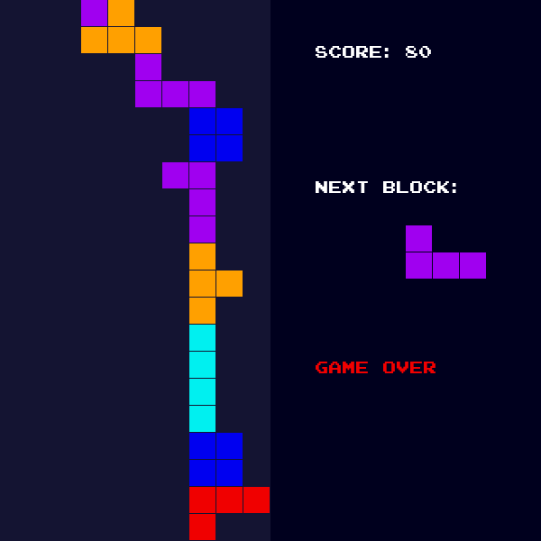

# Specyfikacja aplikacji

## Funkcjonalności

### Klasy
* **Game** - Cały interfejs i pętla gry. Ta klasa zajmuje się logiką i mechaniką gry.
* **Block** - Reprezentuje spadające bloki w grze.
* **Grid** - Reprezentuje siatkę, w której będą pojawiać się bloki.

### Metody klas
* **Game**
    * update_score() - Aktualizuje wynik
    * update_next_block() - Aktualizuje kolejkę bloków
    * update_current_block() - Wybiera blok z kolejki
    * get_random_block() - Losuje blok z listy bloków
    * check_is_block_inside_grid() - Sprawdza czy blok nie wychodzi poza granice siatki
    * check_is_block_touched() - Sprawdza czy blok został dotknięty przez inne postawione bloki.
    * lock_block() - Zatrzymuje blok
    * top_reached() - Sprawdza czy blok nie dotknął sufitu siatki
* **Block**
    * draw_block(schemat_bloku) - Rysuje blok z podanego schematu
* **Grid**
    * draw_grid(row, col) - Rysuje siatkę z podaną liczbą wierszy i kolumn

## Wygląd



## Wymagania techniczne
* Zainstalowany Python (Min. wersja 4.x.x)
* Instalacja biblioteki *Pygame*. Komenda do instalacji:
```pip install pygame```
